# 图像插值算法和直方图分析

## 1 问题描述
在数值计算方法的课程上，我们学习了函数的几种插值算法以及数值积分的算法。在实际生活中，我们经常能够接触到图像这种数据形式。一张图片展现在手机和电脑的屏幕上，我们会觉得很寻常。但从构成上讲，图像其实可以看作一个二元离散函数，它的自变量是横纵方向的坐标x，y，因变量是像素点所带的颜色值。由像素点在两个方向上的铺陈，就构成了一张图像。本文主要研究这两个问题：如何实现图像的放大和缩小？以及如何用数值方法分析图像的特征？问题的答案已经写在标题上，就是插值算法和直方图。

python代码已上传，可以直接运行。另外，在Main代码所在的目录下还有许多生成的图片，可供读者自行观察。

## 2 算法分析

### 2.1 图像数据结构简述
首先，先对于图像的RGB色彩通道做一个简介。
使用python的matplotlib库，能够直接读取图片，并生成一个三维的数组。这个三维数组记录了关于一张图像的色彩信息。其中，前两个维度记录了图像的高度和宽度，第三个维度记录了颜色值，它是个固定值3，代表着颜色的RGB三个通道。确定了坐标（x，y）后，能够得到一个1*3的数组[r,g,b]，分别对应着三种颜色的亮度。其取值从0到255，是离散的。
```python
1.	import numpy as np
2.	import matplotlib.pyplot as plt  
3.	img = plt.imread("wallpaper.jpg")  
4.	print(img.shape)  

>>>(180, 320, 3)  
```
在通过这个数组生成图像的过程中，将它的第三个维度设置成定值0,1,2，就能得到三个颜色的单色图像。整张图像可以看做红绿蓝三个单色图像的叠加。如下图所示。

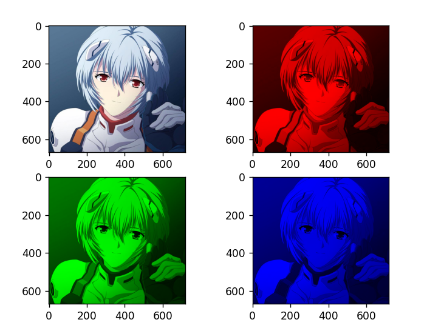

### 2.2 插值算法
在数字图像处理领域，所说的插值算法不同于课上讲到的函数插值。虽然在算法实现上略有差异，但是他们的目的是类似的，就是在给出的已知点之间插入一些值，并且要保持原有的函数的连贯统一。在图像领域，当我们想要放大或缩小一张图的时候，我们会使用到图像插值。实际上就是根据原图片的像素点，通过某种方式在新图片中进行填充像素点的操作。举个例子来说，当我们想把一张16像素（4\*4）的图像放大到64像素（8\*8），即放大到2倍，就需要在16个像素点中间补充上剩下的48个像素，使其变成完整的放大图像。那么这48个像素该如何填充，才能使得放大后的图像顺滑、不违和，就是插值算法所造成的影响。此处我依次使用了四种算法，分别是最近邻插值、线性插值、双线性插值、双三次插值。其中**双线性插值**是诸多图像处理软件最常用的。

#### 2.2.1 最近邻插值
最近邻插值法是这些算法中最简单的一种。将目标图像映射到原图像上，在原图像上寻找与目标像素点距离最近的一个像素点，并把目标像素赋值为该像素点。代码上只需要用int()函数进行舍入，就能得到像素值。

最近邻插值算法是代码最简单的算法，但是放大后的图片效果是最差的，会有很多色块和锯齿。

#### 2.2.2 线性插值
单线性插值，设目标图像点(x, y)在某一条直线上，原图像在这条直线上相邻的两点为 (x0,y0)和(x1,y1) 
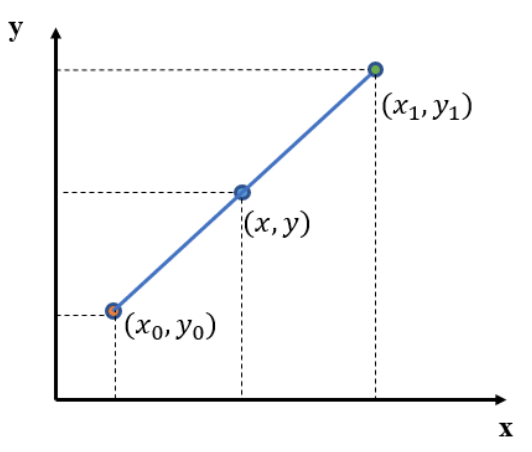
可以得出：$\frac{y-y_0}{x-x_0}=\frac{y_1-y_0}{x_1-x_0}$

从而$y=\frac{x_1-x}{x_1-x_0}y_0+\frac{x-x_0}{x_1-x_0}y_1$

这样通过原图像上的两个点，利用线性关系计算出目标点的像素值，就达成了。简单来说，（x，y）处的像素值，就是上下两点的加权平均。在代码实现上，为了简化运算，也为了接下来的双线性插值更方便，直接把直线设作水平直线，在水平的相邻两点间进行插值。

另外，在原图像上取点的过程中，为了让所有的点都加入计算，采用如下这种方法。
```python
1.	src_x = (des_x + 0.5) * width / desWidth - 0.5    
2.	src_y = int((des_y + 0.5) * height / desHeight - 0.5) 
```

#### 2.2.3 双线性插值
双线性插值，其实是进行了3次单线性插值。

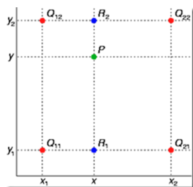

如图，目标点P，原图像点Q12，Q22，Q11，Q21。先在x轴方向上进行两次单线性插值，得到R2和R1点的像素值，再在y方向上进行一次插值，得到P点的像素值。
```python
1.	 value_1 = (src_x_2 - src_x) * img[src_y_1, src_x_1] + (src_x - src_x_1) * img[src_y_1, src_x_2]  # x轴插值  
2.	value_2 = (src_x_2 - src_x) * img[src_y_2, src_x_1] + (src_x - src_x_1) * img[src_y_2, src_x_2]  
3.	value = (src_y_2 - src_y) * value_1 + (src_y - src_y_1) * value_2  # y轴插值  
```

#### 2.2.4 双三次插值

在双线性插值中，需要用到源图像中最近的4个点，而在双三次插值中，需要用到最近的16个点。

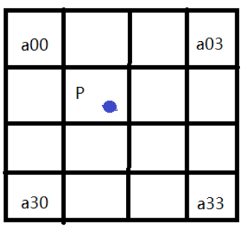

如图，将放大后的目标点缩小并放回原图，得到的点P是一个小数坐标。假设P(x+u, y+v)，其中x, y表示整数部分，u, v分别表示小数部分。这样就能得到最近的16个点的位置，用a00到a33来表示。接下来要做的，就是确定一组系数，把这16个像素点对P点的影响因子算出来，根据这个影响因子来算出这16个点在P点处的“加权平均”，从而得到P点的像素值。

在计算影响因子时，使用的是BiCubic函数。	

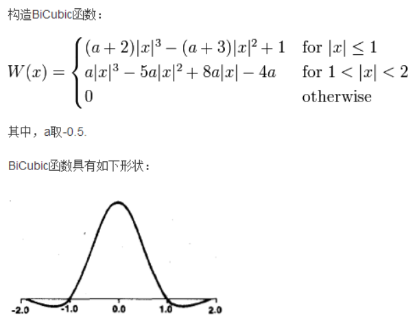

#### 2.2.5 插值结果展示分析
原图像为600\*600像素，放大两倍即为1200\*1200像素。使用matplotlib显示如下：

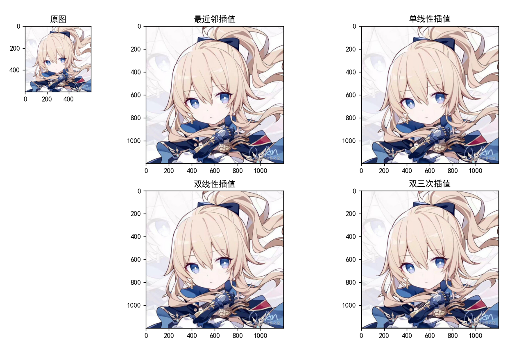

然而这样图片有点小，不太能看清楚效果。将图像放大到相同大小并观察细节。

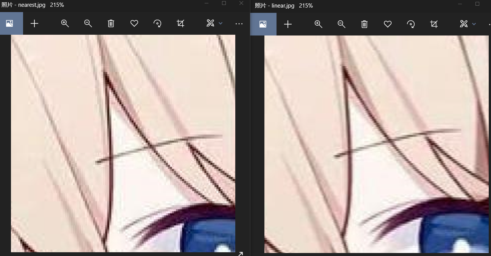
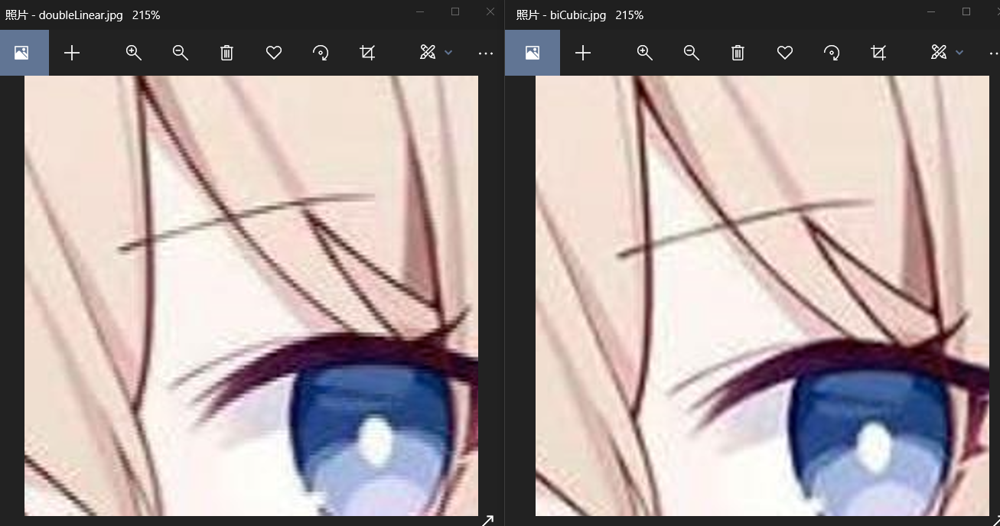

如图，使用Windows的照片程序将四张图片都放大到215%，此时已经能够清楚的看到，最近邻插值的图像有明显的锯齿和色块。单线性和二次线性插值的效果差别不大，但单线性的“条纹”形状更明显一些，二次线性插值相较之下效果更好。而双三次插值在这时仍然能够保持曲线的平滑，效果最好。双三次插值唯一的缺点就是算法复杂度太高，运行时间极慢。加上python本来就慢，运行一次双三次插值需要两三分钟的时间。

### 2.3 直方图分析

#### 2.3.1 直方图
图像的直方图描述了一张图片像素值的分布情况。对于一张黑白图片，其每个像素点具有一个灰度值，范围是从0到255的整型数。直方图是图像灰度值的函数，统计图像中各个灰度级出现的次数。对于彩色的图片，也能分别从RGB三个通道画出其直方图。这里只看灰度图像。直方图的自变量是灰度值（0,255），因变量是某一灰度值在整张图片中出现的次数。在图像处理软件如ps中，可以方便的查看直方图。

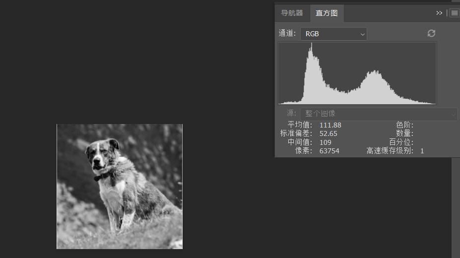

图像的直方图分布能够描述图像的一些性质，是图像的一种重要特征。例如直方图的均值描述图像的亮度，方差描述图像的对比度。要计算一个图像的直方图，需要先构建一个数组hist_map，用来储存灰度值从0到255的频数。然后遍历图像，把频数储存进去，再画出图像就可以了。

#### 2.3.2 直方图均衡化
直方图均衡化算法能够调整画面灰度值的范围。如果原始图像过暗或过亮，使用直方图均衡化能够将亮度调节到适中的范围，使图像变得更加清楚。观察过暗或过量的图像的直方图，会发现他们的直方图明显的偏向左边或右边。同时，观察高对比度和低对比度的图像，也会发现对比度越高，直方图分布的越平均。直方图均衡化，就是调整整张画面的灰度值，使他的直方图分布得更加均匀的一种算法。

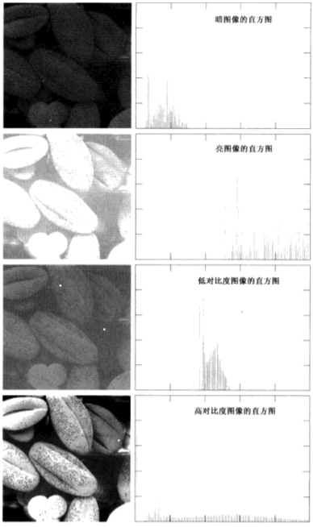

算法的实现上，需要先计算出原图像的直方图，计算出各灰度值出现的频率，和灰度值的累加频率。接下来用累加频率乘以灰度值的总范围并取整，就能得出新图像的灰度值的对应关系。然后就能按照这个对应关系，将原图像变换出新图像。
#### 2.3.3 结果分析

运行程序，成功地画出了图像对应的直方图。和上图中用ps软件画出的直方图比较，基本一致。

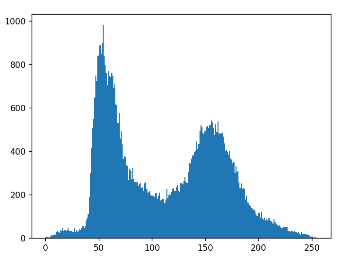

接下来运行直方图均衡化的程序，首先我用手机随手拍了一张欠曝光的照片，对它进行直方图均衡化，得到新的图像。可以看到，新的图像亮度明显提高，对比度也有所增加。观察直方图，可以看到原本密集在左半部分的直方图执行后分散开了。


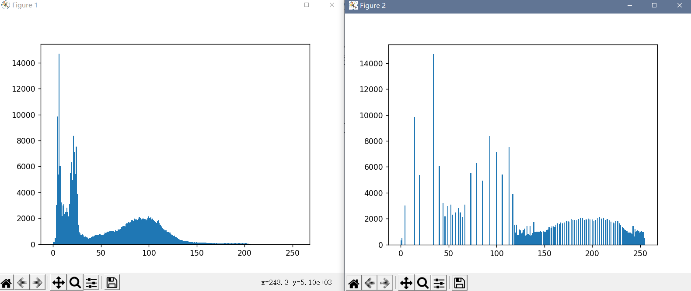

接下来我又拍了一张过曝光的图片。执行同样的程序，可以看到亮度降低了，图片更加清楚。然而图片的右上角仍然是一片白色。观察直方图，最右侧有一条特别高的直线。这是因为在拍摄过程中曝光过高，损失了图像细节。这告诉我们算法虽然能够改善画质，但如果技术太差，算法也救不回来。
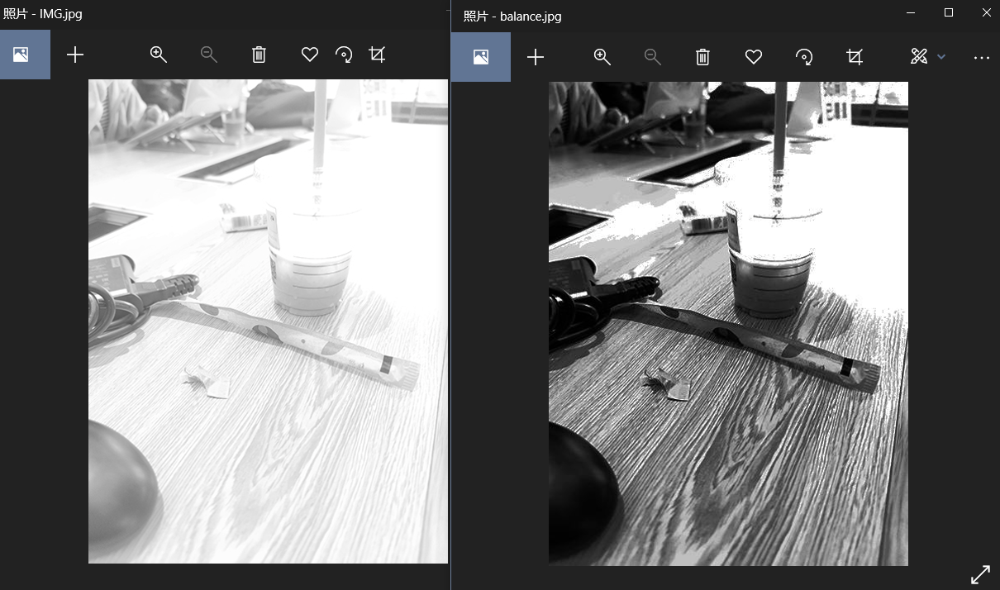
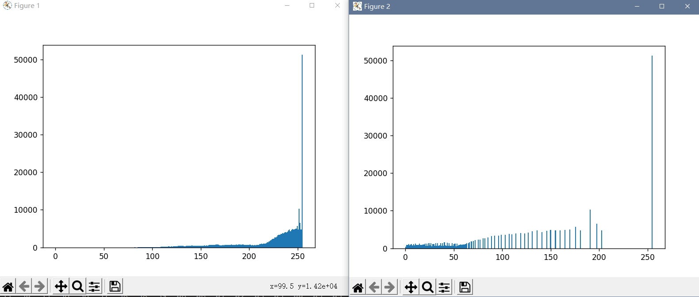

直方图均衡化的算法虽然非常有效，但我们可以看到，它只能把直方图变得更分散，对于单个灰度值过高的情况，如第二张图，直方图均衡化是无能为力的。这是它的一个缺陷。

## 3 总结
在这次的项目中，我了解了图像的构成原理，研究了几种常用的插值算法；了解了图像的直方图，还知道了如何实现直方图均衡化。其实在这个过程中，我多少有点忐忑，因为总感觉自己做的东西和上课讲的关联不大。但是我还是选择了这个题目。首先，图像插值和函数插值在原理和思想上是一致的，直方图和数值积分也多少有点相似。更重要的，图像，或者说计算机中的图像，其实也是一种数值化的记录方式；数字图像处理也是一项很有用的技术。在这过程中我也学到了很多新的东西。
在一次使用ps时，我偶然发现了在导出图片时能够设定导出的像素大小，而ps软件用来缩放图像使用的正是文中提到的这几种算法：双三次、双线性和最近邻插值。它的默认是两次立方插值（双三次）。在实际的生活中发现自己研究的算法，感觉还挺神奇的。值得一提的是，ps使用的这个双三次算法，比我用python写的快多了。看来我写的算法还有很多需要优化的地方。（笑

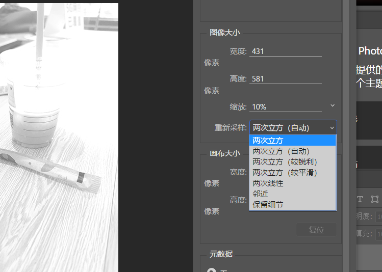